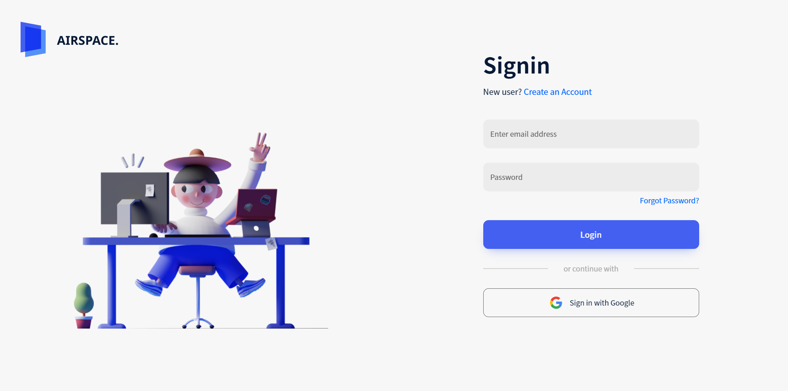
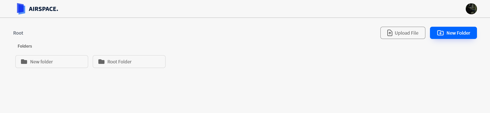
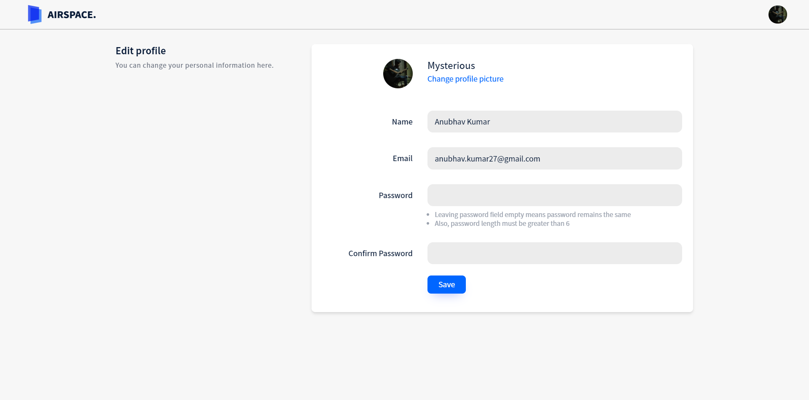

<div align="center">
  
</div>

<h1 align="center">
  Airspace - File Cabinet
</h1>

<p align="center">
  This is a practice project for creating space like Google Drive and Dropbox.
</p>

<p align="center">Below are some screenshots</p>





## 🛠 Installation & Set Up

1. Clone the repo

   ```sh
   git clone https://github.com/keiken-shin/airspace.git
   ```

2. Install dependencies

   ```sh
   npm i
   ```

3. Create **.env.local** file inside root directory

   ```sh
   touch .env.local
   ```

4. Create **Firebase project** and enable **Email** and **Google** auth

5. Then inside .env.local paste firebase confing with the following environment variables.

   ```txt
   REACT_APP_FIREBASE_API_KEY
   REACT_APP_FIREBASE_AUTH_DOMAIN
   REACT_APP_FIREBASE_DATABASE_URL
   REACT_APP_FIREBASE_PROJECT_ID
   REACT_APP_FIREBASE_STORAGE_BUCKET
   REACT_APP_FIREBASE_MESSAGE_SENDER_ID
   REACT_APP_FIREBASE_APP_ID
   ```

6. Start the development server

   ```sh
   npm start
   ```

## 🚀 Building and Running for Production

1. Generate production build

   ```sh
   npm run build
   ```

1. Preview the site as it will appear once deployed

   ```sh
   npx serve -s build
   ```
